<p align="center">
  <a href="https://vibgrate.com"></a>
</p>

<p align="center">
  <strong>@vibgrate/cli</strong>
  <br />
  Local codebase intelligence for AI coding agents — graph, drift, and version-correct docs on your machine
</p>

<p align="center">
  <a href="https://www.npmjs.com/package/@vibgrate/cli"></a>
  <a href="https://www.npmjs.com/package/@vibgrate/cli"></a>
  <a href="https://vibgrate.com/cli"></a>
  <a href="https://vibgrate.com/mcp"></a>
  <a href="./LICENSE"></a>
  
</p>

`vg` answers two questions for any repo:

1. **What is this codebase?** — A deterministic [code graph](https://vibgrate.com/graph): call trees, import paths, impact surfaces, dependency facts.
2. **How far behind is it?** — A ranked **[DriftScore](https://vibgrate.com/driftscore)** (0–100) with runtime/framework lag, dependency age and EOL proximity, and a prioritised fix list.

Everything runs **on your machine**. No API key, no network call, no data leaving your repo unless you explicitly push. The `vibgrate` command is an alias for `vg` — they are interchangeable.

---

## See it run

<p align="center">
  <a href="https://vibgrate.com/cli">
    
  </a>
</p>

<p align="center">
  <sub>A real <code>vg scan</code> replay — drift score, breakdown, and ranked priorities in one command. Animation plays right here on GitHub; nothing runs in your browser.</sub>
</p>

<p align="center">
  <a href="https://vibgrate.com/cli"><strong>▶ Try the live, interactive CLI simulator →</strong></a><br />
  <sub>Step through every command (<code>scan</code>, <code>build</code>, <code>ask</code>, <code>why</code>, …) against real sample repos.</sub>
</p>

---

## Try it in 10 seconds

No install, no signup:

```bash
npx @vibgrate/cli scan          # drift score + upgrade priorities
npx @vibgrate/cli build         # build the code graph
npx @vibgrate/cli ask "what does AuthService do?"
```

Install for repeat runs:

```bash
npm install -D @vibgrate/cli
npx vg scan                     # vg is the primary command; vibgrate is an alias
```

> Local binaries live in `node_modules/.bin` — use `npx vg` (or an npm script) unless you install globally.

---

## Use it with your AI assistant

`vg serve` starts **[Vibgrate AI Context](https://vibgrate.com/library)** — a local-first [MCP](https://vibgrate.com/glossary/model-context-protocol) server that
gives any MCP-compatible assistant (Claude, Cursor, Windsurf, Copilot, Gemini
CLI, …) your code map, **offline drift**, local models, and **version-correct
library docs**, all from your machine (no account, nothing uploaded; thin
local docs fall through to the hosted catalog unless you pass `--local`). No
context-window stuffing, no hallucinated APIs. The map **keeps itself fresh**:
when files change — including edits the assistant itself just made — the next
tool call rebuilds it incrementally before answering, with no watcher or
daemon involved.

Wire it up in one command:

```bash
vg install                      # interactive: pick your assistant(s) and done
vg install --all                # install for every detected assistant at once
```

This writes the MCP config for your chosen tool(s) and installs a skill that teaches the assistant how to query the graph. After reloading your assistant you get graph-aware answers: call trees, impact analysis, drift findings, version-correct library docs — all from local data. The token savings are measured and published, methodology included, at [vibgrate.com/cli/benchmarks/token-savings](https://vibgrate.com/cli/benchmarks/token-savings).

Browse all 21+ supported assistants and their skill descriptions at **[vibgrate.com/skills](https://vibgrate.com/skills)**.

---

## Understand any codebase

Build the graph once, query it continuously:

```bash
vg build                        # index the repo (incremental; re-run after changes)
vg show src/auth/service.ts     # what this file does, calls, and is called by
vg ask "where is rate limiting enforced?"
vg impact src/db/connection.ts  # what breaks if this changes + tests to run
vg path src/api/handler.ts src/db/query.ts   # shortest call path between two files
vg tree src/server.ts           # call tree rooted at a node
vg insights                     # overview: hubs, hotspots, untested paths
```

The graph is byte-deterministic and reproducible — the same repo always produces the same graph on every machine.

```bash
vg share                        # make the graph committable + auto-updating for the team
vg serve                        # start Vibgrate AI Context (local-first MCP: code map + drift + version-correct docs)
```

---

## Measure and manage upgrade drift

```bash
vg scan                         # drift score + risk level + ranked priorities
vg scan --push                  # same, and upload to Vibgrate Cloud for trend tracking
vg baseline                     # snapshot current drift for regression gating
vg report                       # generate a report from a saved scan artifact
```

One scan gives you:

- **Overall score** (0–100) and risk level (**Low / Moderate / High**)
- **Score breakdown** — runtime, frameworks, dependencies, EOL
- **Per-project detail** across Node.js/TypeScript, .NET, Python, and Java
- **Actionable findings** ranked by likely impact
- **[SBOM](https://vibgrate.com/glossary/sbom) export** (CycloneDX / SPDX)
- **Known vulnerabilities** (opt in with `--vulns`) — severity, CVSS, the fixing version, and, in a git repo, who introduced them

---

## Find known vulnerabilities and who introduced them

`vg scan --vulns` checks your installed dependencies against the public [OSV](https://vibgrate.com/glossary/osv) database and reports each known vulnerability with its severity, CVSS score, and the version that fixes it — as text, JSON, or SARIF. Add `--package-manifest` to run it fully offline from a local advisory bundle.

```bash
vg scan --vulns                 # drift score + known vulnerabilities
vg scan --full                  # drift + vulnerabilities + a banned-dependency report
```

In a git repository, every finding is attributed from history: who introduced the vulnerable version, in which commit, and how long you have been exposed. Those exposure windows roll up into remediation metrics framed around the [EU Cyber Resilience Act (CRA)](https://vibgrate.com/compliance/cra) — per-severity time-exposed and SLA breaches — so "are we fixing things fast enough?" has a number.

```bash
vg why lodash                   # who added a dependency, every version since, and any open vulnerabilities
vg bisect lodash 4.17.21        # the commit where lodash crossed a version line (e.g. reached the fix)
```

Detection and attribution span the whole npm ecosystem (npm, pnpm, yarn) plus pip/poetry, cargo, composer, bundler, go, pub, hex, NuGet, and Maven/Gradle — read from each project's lockfile, so it works whatever you build in.

Your AI assistant sees this too: `vg serve` exposes `list_vulnerabilities`, `vuln_attribution`, and an `upgrade_impact` tool that tells an agent what an upgrade will cost — version distance, how many files import the package, the vulnerabilities it fixes, and (online, opt in) the breaking-change notes between your version and the latest.

---

## Track drift over time → create a free workspace

The CLI is fully useful offline. When you want **trends across runs and repos** — so drift becomes a metric you manage, not a surprise you discover — push scans to a [Vibgrate Cloud](https://vibgrate.com/cloud) workspace:

1. **Create a workspace** at **[dash.vibgrate.com](https://dash.vibgrate.com)** and copy your DSN.
2. **Connect and push:**

```bash
VIBGRATE_DSN="vibgrate+https://<key_id>:<secret>@us.ingest.vibgrate.com/<workspace_id>" \
  vg scan --push
```

Upload is opt-in — nothing leaves your machine until you run `--push`. Store the DSN as a CI secret, never commit it.

**[→ Create your workspace](https://dash.vibgrate.com)**

---

## CI integration

Drop `vg` into any pipeline to turn drift scoring into a quality gate:

```yaml
# GitHub Actions — drift gate + SARIF upload
- name: Vibgrate scan
  env:
    VIBGRATE_DSN: ${{ secrets.VIBGRATE_DSN }}
  run: npx @vibgrate/cli scan --push --format sarif --out vibgrate.sarif --fail-on error

- name: Upload SARIF
  if: always()
  uses: github/codeql-action/upload-sarif@v3
  with:
    sarif_file: vibgrate.sarif
```

Gate on drift budgets and regression relative to a baseline:

```bash
vg baseline
vg scan --baseline .vibgrate/baseline.json --drift-budget 40 --drift-worsening 5
```

- `--drift-budget <score>` fails the build if drift exceeds your budget.
- `--drift-worsening <percent>` fails the build if drift worsens by more than X% vs baseline.

Copy-paste CI templates live in `examples/github-actions/`. Azure DevOps and GitLab CI snippets are in [DOCS.md](./DOCS.md#ci-integration).

---

## Version-correct library docs

`vg lib` fetches usage docs pinned to the **exact version in your lockfile** — never a newer API your code can't call yet:

```bash
vg lib react                    # React docs at your installed version
vg lib express --fn middleware  # specific function reference
```

AI assistants connected via MCP use `vg lib` automatically when answering questions about library APIs in your project.

---

## SBOM and OpenVEX

```bash
vg sbom export --format cyclonedx --out sbom.cdx.json
vg sbom export --format spdx     --out sbom.spdx.json
vg sbom delta  --from .vibgrate/baseline.json --to .vibgrate/scan_result.json --out delta.txt
vg vex                          # generate an OpenVEX document for attestation
```

---

## Privacy & offline-first

- No data leaves your machine unless you run `--push` / `vg push` / `vg share`.
- Drift scoring reads manifests and configs only. The code graph (`vg build`/`vg map`) and a few extended scanners (code quality, database schema, UI text) read your source **locally** to compute structural facts and metrics — never a raw source line, and never uploaded as-is; see [DOCS.md](./DOCS.md#extended-scanners) for exactly what each one reads.
- Works without login and without any SaaS dependency.
- `--offline` disables registry/network lookups; `--package-manifest <file>` feeds drift scoring a local version bundle.
- `--max-privacy` suppresses local artifact writes and high-context scanners; `--no-local-artifacts` skips writing `.vibgrate/*.json` to disk.

```bash
vg scan --offline --package-manifest ./package-versions.zip --max-privacy --format json --out scan.json
```

Add `.vibgrate/` to your `.gitignore` — those are regenerated local outputs.

More on how Vibgrate handles code and data: [vibgrate.com/security](https://vibgrate.com/security).

---

## Quick start with AI assistants

Paste this into your AI coding tool (Claude, Cursor, Copilot, Gemini CLI, …):

```
Set up Vibgrate for local codebase intelligence:
1. Install: npm install -g @vibgrate/cli@latest
2. Build the graph: vg build
3. Wire your assistant: vg install
4. Ask: vg ask "what are the main entry points?"
Then explain the architecture and my top 3 upgrade priorities.
```

See [docs/QUICKSTART-PROMPT.md](./docs/QUICKSTART-PROMPT.md) for the full prompt.

---

## Command reference

### Code graph

| Command | Description |
| --- | --- |
| `vg ask "<question>"` | Query the map in natural language |
| `vg benchmark` | Reproducible build + memory + token-reduction benchmark (honest estimates) |
| `vg build [path]` | Build / update the code map (incremental, deterministic) |
| `vg bundle` | Build an air-gapped bundle (grammars + graph + library catalog) |
| `vg embed` | Precompute the semantic index for instant `vg ask` |
| `vg export` | Export the map (json / ndjson / graphml / dot / cypher / md / html / SBOM) |
| `vg facts <file>` | Deterministic facts for a node (contracts, invariants) |
| `vg guide <file>` | Cited standards / practices for a node (free pack) |
| `vg impact <file>` | What breaks if you change it — and the tests to run |
| `vg install` / `vg uninstall` | Wire (or remove) **Vibgrate AI Context** + skill in your AI assistant |
| `vg lib <package>` | Version-correct, drift-annotated library docs |
| `vg map` / `vg hubs` / `vg areas` / `vg oddities` | Map insights: overview, most-depended-on code, natural groupings, cross-area smells |
| `vg models` | The local model fleet (Ollama / LM Studio / gguf), discovered offline |
| `vg path <from> <to>` | How A connects to B (shortest path) |
| `vg savings` | Local report of tokens/$ saved vs a grep baseline (estimates) |
| `vg serve` | Start **Vibgrate AI Context** (local-first MCP: code map + drift + version-correct docs) |
| `vg share` | Make the graph committable + auto-updating for your team |
| `vg show <file>` | Explain a node: what it is, what it calls, what calls it |
| `vg status` | Cache/freshness, counts, staleness |
| `vg tests <file>` | Which tests cover a node |
| `vg tree <file>` | Call tree rooted at a node |
| `vg unknowns` | What the graph cannot resolve, ranked by blast radius |

### Drift reporting

| Command | Description |
| --- | --- |
| `vg baseline [path]` | Create a drift baseline |
| `vg bisect <package> <constraint>` | The commit where a dependency crossed a version line (`--assert` to gate CI) |
| `vg drift` | What is outdated across dependencies (offline; `--online` for currency) |
| `vg dsn create` | Generate a DSN token |
| `vg fix` | Ranked, risk-tiered upgrade plans from the hosted planner — then apply the one you choose |
| `vg init [path]` | Initialise config and `.vibgrate/` |
| `vg login` / `vg logout` | Authenticate the CLI with your Vibgrate workspace (or clear stored credentials) |
| `vg push` | Upload scan results to Vibgrate Cloud |
| `vg report` | Generate a report from a scan artifact |
| `vg sbom export` / `delta` / `vex` | Export CycloneDX/SPDX SBOM, diff two artifacts, or emit an OpenVEX document |
| `vg scan [path]` | Scan for upgrade drift |
| `vg scan --vulns` | Also detect known vulnerabilities (OSV; offline via `--package-manifest`) |
| `vg scan --full` | Comprehensive scan: drift + vulnerabilities + a banned-dependency report |
| `vg scan --push` | Scan and push results to Vibgrate Cloud |
| `vg update` | Check for and install updates |
| `vg why <package>` | Who introduced a dependency, its version history, and any open vulnerabilities |

```bash
vg scan [path] [--vulns] [--full] [--format text|json|sarif|md] [--out <file>] [--fail-on warn|error] \
  [--offline] [--package-manifest <file>] [--no-local-artifacts] [--max-privacy] \
  [--drift-budget <score>] [--drift-worsening <percent>] [--baseline <file>]
```

Full flag and configuration reference: **[DOCS.md](./DOCS.md)** · **[vibgrate.com/cli](https://vibgrate.com/cli)**.

---

## Why teams adopt Vibgrate

Most systems don't fail all at once — they accumulate upgrade debt and architectural [drift](https://vibgrate.com/glossary/code-drift) silently until migrations become expensive. `vg` makes that debt measurable and repeatable — the practice we call [Code Drift Intelligence](https://vibgrate.com/code-drift-intelligence) — and gives AI assistants the local context they need to be useful:

| Mode | What you get | Best for |
| --- | --- | --- |
| **One-off scan** | Fast snapshot of drift score, lag, and findings | Audits, due diligence, migration planning |
| **CI-integrated scan** | Continuous drift signal, SARIF annotations, regression guardrails | Keeping upgrade debt under control long-term |
| **MCP + graph** | AI assistant with real-time, offline codebase context | Day-to-day development, code review, refactoring |

Recommended rollout: `vg build` + `vg install` now, add `vg scan` to CI this week.

---

## Requirements

- Node.js **22+**
- macOS, Linux, Windows

## Command name conflicts

`vg` is short and occasionally conflicts with other tools (`virtualgo`, `vugu`, the oh-my-zsh `git verify-commit` alias, custom shell aliases, etc.).

**`vibgrate` is an identical alias** — same binary, same flags, same behaviour. If `vg` is taken on your system, use `vibgrate` everywhere instead:

```bash
vibgrate scan          # same as: vg scan
vibgrate build         # same as: vg build
vibgrate serve         # same as: vg serve
```

When `@vibgrate/cli` is installed, it registers **both** bin entries unconditionally. If it detects at install time that `vg` is already claimed by another tool, it prints a one-line notice pointing you to `vibgrate`.

---

<p align="center">
  <a href="https://dash.vibgrate.com"><strong>Create a free workspace →</strong></a>
  &nbsp;·&nbsp;
  <a href="https://vibgrate.com/cli">Try the live demo</a>
  &nbsp;·&nbsp;
  <a href="https://vibgrate.com/cli/benchmarks">Benchmarks</a>
  &nbsp;·&nbsp;
  <a href="https://vibgrate.com/library">Vibgrate AI Context (local MCP)</a>
  &nbsp;·&nbsp;
  <a href="https://vibgrate.com/mcp">Vibgrate MCP (hosted)</a>
  &nbsp;·&nbsp;
  <a href="https://vibgrate.com/skills">AI agent skills</a>
  &nbsp;·&nbsp;
  <a href="./DOCS.md">Full docs</a>
</p>

<p align="center">
  <sub>Apache-2.0 licensed · Copyright © 2026 Vibgrate</sub>
</p>
