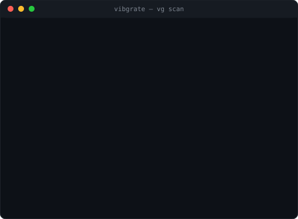

<p align="center">
  <a href="https://vibgrate.com"></a>
</p>

<p align="center">
  <strong>@vibgrate/cli</strong>
  <br />
  Local codebase intelligence for AI coding agents — graph, drift, and version-correct docs on your machine
</p>

<p align="center">
  <a href="https://www.npmjs.com/package/@vibgrate/cli"></a>
  <a href="https://www.npmjs.com/package/@vibgrate/cli"></a>
  <a href="https://dash.vibgrate.com/badges/driftscore/vibgrate/cli"></a>
  <a href="https://vibgrate.com/cli"></a>
  <a href="https://vibgrate.com/vgcode"></a>
  <a href="https://vibgrate.com/mcp"></a>
  <a href="./LICENSE"></a>
  
</p>

`vg` answers three questions for any repo:

1. **What is this codebase?** — A deterministic [code graph](https://vibgrate.com/graph): call trees, import paths, impact surfaces, dependency facts.
2. **How far behind is it?** — A ranked **[DriftScore](https://vibgrate.com/driftscore)** (0–100) with runtime/framework lag, dependency age and EOL proximity, and a prioritized fix list. Exposure is scored separately as a **[RiskScore](https://vibgrate.com/riskscore)**; the two together are the **[DriftRisk Index](https://vibgrate.com/driftrisk)**. The full methodology — formulas, sources, and limitations — is published as a [whitepaper](https://vibgrate.com/whitepapers/software-risk-and-drift-scoring-methodology) under CC BY 4.0 (DOI [10.5281/zenodo.21336304](https://doi.org/10.5281/zenodo.21336304)).
3. **Can we fix it here?** — [**VG Code**](#vg-code--write-the-change-not-just-the-report), a coding agent whose search tool is the code graph, not a grep — in your terminal as `vg code` and as the VG Code panel in [Vibgrate for VS Code](https://vibgrate.com/vscode) — plus `vg fix`, ranked upgrade plans it can apply.

Everything runs **on your machine**. No API key, no network call, no data leaving your repo unless you explicitly push. The `vibgrate` command is an alias for `vg` — they are interchangeable.

---

## See it run

<p align="center">
  <a href="https://vibgrate.com/cli">
    
  </a>
</p>

<p align="center">
  <sub>A real <code>vg scan</code> replay — drift score, breakdown, and ranked priorities in one command. Animation plays right here on GitHub; nothing runs in your browser.</sub>
</p>

<p align="center">
  <a href="https://vibgrate.com/cli"><strong>▶ Try the live, interactive CLI simulator →</strong></a><br />
  <sub>Step through every command (<code>scan</code>, <code>build</code>, <code>ask</code>, <code>why</code>, …) against real sample repos.</sub>
</p>

---

## Try it in 10 seconds

No install, no signup:

```bash
npx @vibgrate/cli scan          # drift score + upgrade priorities
npx @vibgrate/cli build         # build the code graph
npx @vibgrate/cli ask "what does AuthService do?"
npx @vibgrate/cli code          # a coding agent — it asks before every edit
```

Install for repeat runs:

```bash
npm install -D @vibgrate/cli
npx vg scan                     # vg is the primary command; vibgrate is an alias
```

> Local binaries live in `node_modules/.bin` — use `npx vg` (or an npm script) unless you install globally.

---

## Use it with your AI assistant

`vg serve` starts **[Vibgrate AI Context](https://vibgrate.com/library)** — a local-first [MCP](https://vibgrate.com/glossary/model-context-protocol) server that
gives any MCP-compatible assistant (Claude, Cursor, Windsurf, Copilot, Gemini
CLI, …) your code map, **offline drift**, local models, and **version-correct
library docs**, all from your machine (no account, nothing uploaded; thin
local docs fall through to the hosted catalog unless you pass `--local`). No
context-window stuffing, no hallucinated APIs. The map **keeps itself fresh**:
when files change — including edits the assistant itself just made — the next
tool call rebuilds it incrementally before answering, with no watcher or
daemon involved.

Wire it up in one command:

```bash
vg install                      # interactive: pick your assistant(s) and done
vg install --all                # install for every detected assistant at once
```

This writes the MCP config for your chosen tool(s) and installs a skill that teaches the assistant how to query the graph. After reloading your assistant you get graph-aware answers: call trees, impact analysis, drift findings, version-correct library docs — all from local data. The token savings are measured and published, methodology included, at [vibgrate.com/cli/benchmarks/token-savings](https://vibgrate.com/cli/benchmarks/token-savings).

Browse all 21+ supported assistants and their skill descriptions at **[vibgrate.com/skills](https://vibgrate.com/skills)**.

## Tools

`vg serve` exposes 19 MCP tools:

- **orient** — start here: project overview, entry points, where to look first.
- **search_symbols** — find a symbol by name or literal string.
- **query_graph** — find code by meaning: symptoms, relationships, what-breaks-if.
- **get_node** — inspect one symbol: signature, callers, callees, area.
- **find_path** — shortest connection between two symbols.
- **impact_of** — blast radius of a change: dependents, files, covering tests, risk.
- **tests_for** — which tests cover a symbol.
- **get_graph_summary** — code map overview: counts, languages, top areas and hubs.
- **list_areas** — code areas (communities) by size.
- **list_hubs** — most-depended-on symbols.
- **get_facts** — deterministic facts for a node (contract / invariant / characterization).
- **guide_node** — cited standards and practices for a node (OWASP/CWE).
- **check_drift** — offline dependency inventory with optional git who-added attribution.
- **vuln_attribution** — who introduced each open vulnerability, exposure windows, CRA remediation metrics.
- **list_vulnerabilities** — known vulnerabilities from the last `vg scan --vulns`: CVE, severity, CVSS, fixed version.
- **upgrade_impact** — what breaks if you upgrade a package: major distance, import blast radius, vulns fixed.
- **list_models** — local models on disk (Ollama / LM Studio / gguf).
- **resolve_library** — resolve a library to its canonical id and the version your project uses.
- **library_docs** — version-correct usage docs for a library, sliced to a token budget.

Prefer the hosted server over your team's scan data? **[Vibgrate Cloud MCP](https://vibgrate.com/mcp)** connects your assistant to Vibgrate Cloud (OAuth 2.1, 51 tools).

---

## Understand any codebase

Build the graph once, query it continuously:

```bash
vg build                        # index the repo (incremental; re-run after changes)
vg show src/auth/service.ts     # what this file does, calls, and is called by
vg ask "where is rate limiting enforced?"
vg impact src/db/connection.ts  # what breaks if this changes + tests to run
vg path src/api/handler.ts src/db/query.ts   # shortest call path between two files
vg tree src/server.ts           # call tree rooted at a node
vg insights                     # overview: hubs, hotspots, untested paths
```

The graph is byte-deterministic and reproducible — the same repo always produces the same graph on every machine.

```bash
vg share                        # make the graph committable + auto-updating for the team
vg serve                        # start Vibgrate AI Context (local-first MCP: code map + drift + version-correct docs)
```

---

## VG Code — write the change, not just the report

**VG Code** is the coding agent inside Vibgrate CLI. Its search tool is the deterministic code graph — **not a grep, not embeddings over chunks** — and it runs on a local model or a hosted one, your choice.

```bash
vg code                                            # guided: pick a model, then describe tasks
vg code "add a --timeout flag to the scan command"
```

**Does it write to your disk?** Yes — through steps you approve, and only those. Read-only steps (search, read, list, impact) run without prompting; every edit and every command asks first. `--auto` runs the same loop with no prompts for CI. Without a terminal and without `--auto`, `vg code` refuses to start rather than writing unattended.

**Two surfaces, one agent.** `vg code` is the terminal surface. The **VG Code panel** in [Vibgrate for VS Code](https://vibgrate.com/vscode) is the graphical one, and for most people it will be the one they live in: warm sessions between tasks, chat history, inline Approve / Reject cards with diffs, checkpoints, and @-mentions. The extension does not re-implement the agent — it runs the one shipped with this CLI over `--stream-json` and relays your decisions to it, so terminal, editor, and CI behave the same way.

### Why an agent here, and not another chat window?

- **Search is the graph.** `search_code` resolves symbols, callers, and callees from the map `vg build` produced — so the model gets the three functions that matter, not forty files that mention the word.
- **Blast radius before the edit.** `graph_impact` tells the model what depends on a symbol *before* it changes it, and `vg tests` knows which tests to run after.
- **Version-correct library docs.** `library_docs` pins to the version in your lockfile, so the model writes against the API you actually have.
- **Invented identifiers are blocked, not flagged.** Before an edit is written, its replacement body is scanned against the graph's identifier trie. A symbol the graph does not know — and that is not already local to the target file — stops the write.
- **Local models are first-class, hosted models are one flag away.** With a pulled model there is no account and no key, and Code Modes fit the model to the machine. When a task needs more, [Vibgrate Relay](https://vibgrate.com/relay) supplies hosted models on your Vibgrate account — no per-provider API keys — and falls back to your local model if it is unreachable.
- **It adopts the MCP servers you already have.** `.mcp.json` (Claude Code), `.cursor/mcp.json`, and `.vscode/mcp.json` are read and merged with `.vibgrate/code.json`, which wins on a name clash.
- **Cost is visible.** A token/$ meter after each task and on `/cost`; `vg savings` reports graph-backed calls per model.

**Trade-off:** no model ships with the CLI, and VG Code is only as good as the model you point it at. A 7B local model is not a frontier model — it buys you privacy, offline inference, and no per-token cost. Relay buys you capacity at a per-token price. Pick the tier that matches the task; the graph grounding is the same either way.

### A session, end to end

```text
  VG Code  · graph-grounded coding · v2026.x

  ✔ Code map built
  ✔ Model catalog loaded
  ◆ Ready — ollama/qwen2.5-coder:7b · graph 48213. Describe a task, or /help.

  code › add a --timeout flag to the scan command and use it

    → search_code(query: --timeout flag scan command)
      scanCommand (function) src/commands/scan.ts:12
    → graph_impact(symbol: runScan)
      3 symbol(s) depend on runScan: …
    → edit_file(path: src/commands/scan.ts, …)
  ? Apply edit to src/commands/scan.ts? [Y/n] y
      ✔ edited src/commands/scan.ts
    → run_command(command: npm test -- scan)
  ? Run `npm test -- scan`? [y/N] y
      ✔ exit 0  … 12 passing

  ✔ added a --timeout flag to scan and covered it with tests
    +6 -1 across 1 file(s) · via ollama/qwen2.5-coder:7b
```

What happened, step by step:

1. The code map is built or refreshed incrementally — only changed files re-parse.
2. The model catalog loads and you pick a local model or a hosted provider. Before pulling a local model, a memory pre-flight compares its estimated footprint against available RAM/VRAM and refuses a model this machine cannot run.
3. Vibgrate Graph (`vg serve`) starts as a child process for the life of the session and stops when you exit. Every graph call is attributed to VG Code and the model in use.
4. The agent loops: search → read → assess impact → edit → run.
5. You approve each mutating step, or it runs unattended under `--auto`.
6. Edits land through a deterministic merge, so the change goes exactly where it was meant to.

### Approval modes

| Mode | Behavior |
| --- | --- |
| **Interactive** (default) | Read-only steps run freely. Every edit and every command asks first. |
| **`--auto`** | No prompts. A denylist blocks catastrophic commands — filesystem wipes, `curl … \| sh`, force-push, `sudo`. For CI and scripted runs. |
| **`--single`** | One-shot: propose a diff and stop. No tool loop, no commands. Dry-run unless you pass `--apply --yes`. |

`--max-steps <n>` caps the loop (default 24). `--worktree` runs the whole session in an isolated git worktree so nothing touches your main tree until you apply it.

### Which model — local, or hosted through Relay

**Code Modes** pick a local model that actually fits this machine, checked against your real RAM, VRAM, and disk before anything downloads:

| Mode | Intent |
| --- | --- |
| **Spark** | Fast, small footprint — quick edits and tight memory |
| **Flow** | Balanced default for day-to-day coding |
| **Forge** | Heavier pack when you have headroom and want more capacity |

```bash
vg models                       # what's set, and what fits this machine
vg models install flow          # install the pack (--dry-run to preview)
vg models pull qwen2.5-coder:7b
```

**[Vibgrate Relay](https://vibgrate.com/relay)** is the hosted tier that supplements those local models when a task needs more capacity than the machine has. One Vibgrate account and endpoint, a curated catalog of hosted models, per-token metering against prepaid credit — and no per-provider API keys to manage:

```bash
export VIBGRATE_RELAY_TOKEN=…   # Relay is then preferred, with local fallback
vg code --provider vibgrate-relay --model <slug>
```

You are not locked to it. `--provider` also takes `ollama`, `lmstudio`, `foundry-local`, `llama-cpp`, `openrouter`, `litellm`, `openai`, and `together`; those API keys are read from the environment only (`OPENROUTER_API_KEY` and friends), never passed as flags. With no `--provider`, `vg code` uses what you have already configured — Relay first if its token is set, then another hosted key, then a local model — and never dials an endpoint you did not set up. `--local` keeps it on-device.

### Tools the agent has

| Tool | What it does | Approval |
| --- | --- | --- |
| `search_code` | Search the code graph — symbols and relations, plus a literal sweep for exact phrases | free |
| `read_file` / `list_files` | Read a file or line range; list files in the map | free |
| `graph_impact` | Blast radius of changing a symbol | free |
| `library_docs` | Version-correct docs for a dependency you actually have installed | free |
| `edit_file` / `create_file` / `delete_file` / `apply_patch` | Change the working tree | **approved** |
| `run_command` | Run tests, builds, anything else | **approved** |
| `web_fetch` / `web_search` | Fetch or search the public web — untrusted, secret-redacted, size-capped | **approved** |
| `browser_*` / `read_notebook` / `spawn_subagent` | Drive a browser, work in Jupyter notebooks, delegate a sub-task | **approved** |
| `mcp__<server>__<tool>` | Tools from your configured MCP servers | free if read-only, else **approved** |

### In-session commands

| Command | What it does |
| --- | --- |
| `/undo` | Revert the files changed by the last task |
| `/diff` | Show the last change |
| `/model` | Switch model without leaving the session |
| `/cost` | Running token and dollar cost (local models are free) |
| `/compact` | Condense the session so far into one checkpoint recap |
| `/help` / `/exit` | List commands / quit |

### Where state lives

| On disk | In the session |
| --- | --- |
| The code map (`.vibgrate/`), gitignored | Conversation and step history |
| Your config (`.vibgrate/code.json`) | The `/undo` stack |
| The edits themselves — local and git-reversible | The token/$ meter |
| Session store, so `--continue` can resume | The `vg serve` child process |

`--continue` resumes your most recent session: it recaps what was already done for the model and restores `/undo`.

### Configure once

`.vibgrate/code.json` — flags still override:

```json
{
  "provider": "ollama",
  "model": "qwen2.5-coder:7b",
  "testCommand": "npm test",
  "auto": false,
  "denyCommands": ["deploy", "kubectl\\s+delete"],
  "maxSteps": 24,
  "mcpServers": {
    "playwright": { "command": "npx", "args": ["-y", "@playwright/mcp"] }
  }
}
```

Full key reference — including `securityTier`, `capsule`, and `modelProfile` — is in [DOCS.md](./DOCS.md#vg-code).

### Safety

- Secrets files (`.env`, `.npmrc`, `.netrc`, key material) are never read into a prompt, and credential shapes are redacted from any file the agent does read.
- Under `--auto`, a denylist blocks catastrophic commands. Interactively you see and approve every command yourself.
- Every change is local and git-reversible. `/undo` reverts the last task; `--worktree` keeps the whole session off your main tree.
- Web and browser results are treated as untrusted content, never as instructions.

---

## Measure and manage upgrade drift

```bash
vg scan                         # drift score + risk level + ranked priorities
vg scan --push                  # same, and upload to Vibgrate Cloud for trend tracking
vg baseline                     # snapshot current drift for regression gating
vg report                       # generate a report from a saved scan artifact
```

One scan gives you:

- **Overall score** (0–100) and risk level (**Low / Moderate / High**)
- **Score breakdown** — runtime, frameworks, dependencies, EOL
- **Per-project detail** across Node.js/TypeScript, .NET, Python, and Java
- **Actionable findings** ranked by likely impact
- **[SBOM](https://vibgrate.com/glossary/sbom) export** (CycloneDX / SPDX)
- **Known vulnerabilities** (opt in with `--vulns`) — severity, CVSS, the fixing version, and, in a git repo, who introduced them

---

## Find known vulnerabilities and who introduced them

`vg scan --vulns` checks your installed dependencies against the public [OSV](https://vibgrate.com/glossary/osv) database and reports each known vulnerability with its severity, CVSS score, and the version that fixes it — as text, JSON, or SARIF. Add `--package-manifest` to run it fully offline from a local advisory bundle.

```bash
vg scan --vulns                 # drift score + known vulnerabilities
vg scan --full                  # drift + vulnerabilities + a banned-dependency report
```

In a git repository, every finding is attributed from history: who introduced the vulnerable version, in which commit, and how long you have been exposed. Those exposure windows roll up into per-severity time-exposed and SLA-breach metrics, framed around the [EU Cyber Resilience Act (CRA)](https://vibgrate.com/cra) — so "are we fixing things fast enough?" has a number.

That answers the question about *this checkout*. For the question a regulator asks — which **shipped** products contain it — see [Vibgrate Evidence](#vibgrate-evidence--answer-which-shipped-products-contain-this) below.

```bash
vg why lodash                   # who added a dependency, every version since, and any open vulnerabilities
vg bisect lodash 4.17.21        # the commit where lodash crossed a version line (e.g. reached the fix)
```

Detection and attribution span the whole npm ecosystem (npm, pnpm, yarn) plus pip/poetry, cargo, composer, bundler, go, pub, hex, NuGet, and Maven/Gradle — read from each project's lockfile, so it works whatever you build in.

Your AI assistant sees this too: `vg serve` exposes `list_vulnerabilities`, `vuln_attribution`, and an `upgrade_impact` tool that tells an agent what an upgrade will cost — version distance, how many files import the package, the vulnerabilities it fixes, and (online, opt in) the breaking-change notes between your version and the latest.

---

## Vibgrate Evidence — answer "which shipped products contain this?"

A scanner tells you about the code in front of you. A regulator asks about the code you **shipped** — eighteen months ago, at version 3.2.1, into Germany and France, still in its support window. **[Vibgrate Evidence](https://vibgrate.com/evidence)** answers that question as a signed artifact a third party can verify offline, with no account and no network.

It produces **evidence, not a verdict.** It will not tell you that you are compliant, and it is not legal advice. It gives you a defensible, reproducible answer and the audit trail behind it; the determination and the filing stay yours.

```bash
vg evidence init --regime cra                       # who files, and to which coordinator
vg evidence product add "Acme Gateway" --markets DE,FR --in-scope
vg evidence release acme-gateway 3.2.1 --from sbom.cdx.json --ship-date 2025-02-14
vg evidence exposure CVE-2025-12345 --bundle ./ev   # signed answer, exit code for CI
```

### Why freeze a manifest instead of scanning again?

- **Ships are immutable; your tree is not.** `exposure` matches against the manifest **frozen at ship time**, not `HEAD`. Re-scanning today tells you what you would ship now, which is not the question asked.
- **It refuses to guess.** A product bound to a release with no frozen manifest comes back `undetermined` **with a reason**, never a confident-looking `not affected`. That distinction is the whole value of the artifact.
- **Jurisdiction-neutral by design.** Reporting duties are modeled as **regimes**: the EU CRA (`--regime cra`, applies from **11 September 2026**) and DORA incident reporting (`--regime dora-incident`) ship today. A new jurisdiction is a regime profile, not a new command or a new tool.
- **No model touches a figure.** Nothing in the evidence path is generated by a language model. Every number is computed from frozen manifests and advisory data.
- **Offline end to end.** `--offline` with a local advisory file needs no network, and `vg evidence verify` works on a machine that has never heard of Vibgrate.

**Trade-off:** the answer is only as good as the manifests you froze. Evidence cannot reconstruct what you shipped before you started recording it — a release you never froze is `undetermined`, permanently. The value compounds from the day you start, which is the argument for starting now rather than in September.

### The lifecycle

| Step | Command | What it does |
| --- | --- | --- |
| 1. Set up | `vg evidence init` | Org, coordinator CSIRT, and the person with filing authority |
| 2. Register | `vg evidence product add` | A product with digital elements — markets, classification, scope rationale |
| 3. Freeze | `vg evidence release` | Pin a shipped version to an immutable component manifest, from an SBOM or scan |
| 4. Ask | `vg evidence exposure <vuln>` | Which shipped products contain it, at which versions, in which markets, still in support |
| 5. Prove | `vg evidence verify <bundle>` | Re-check the signed answer offline, on any machine |

Between those: `vg evidence readiness` is a deterministic gap report against the regime's obligations, `vg evidence regimes` lists the regimes and their clocks, `vg evidence drill` runs a timed rehearsal against a simulated advisory, `vg evidence watch` joins the CISA KEV catalog to your frozen manifests, `vg evidence pack` builds the submission pack a human pastes into the reporting platform, and `vg evidence export` writes an air-gapped bundle of everything.

### What is in a bundle, and what "verified" means

`--bundle <dir>` writes `result.json`, a DSSE/Ed25519 in-toto attestation over it (`evidence.intoto.jsonl`), a `VERIFY.md` a third party can follow, and — with `--tsa <url>` — an RFC 3161 trusted-timestamp token (`timestamp.tsr`).

`vg evidence verify` reports one of three honest states, and the middle one matters:

| State | Meaning |
| --- | --- |
| `verified` | Signature checks, the signer is pinned to a trust root you supplied with `--pub`, **and** the result digest still matches |
| `unverified` | Cryptographically intact and unmodified, but the signer is not pinned — real, and not yet trusted by you |
| `failed` | Bad signature, or a `result.json` that no longer matches what was signed |

Exit codes make it a CI gate: **0** no exposure · **2** exposure found · **3** undetermined, needs manual review · **1** operational error.

Evidence state lives in `.vibgrate/evidence/`. The Ed25519 signing key is minted on first use at `.vibgrate/attest-key.pem` (mode `0600`, with a `.pub` beside it) unless you point at your own with `VG_ATTEST_KEY` — back it up, and never commit it.

---

## Track drift over time → create a free workspace

The CLI is fully useful offline. When you want **trends across runs and repos** — so drift becomes a metric you manage, not a surprise you discover — push scans to a [Vibgrate Cloud](https://vibgrate.com/cloud) workspace:

1. **Create a workspace** at **[dash.vibgrate.com](https://dash.vibgrate.com)** and copy your DSN.
2. **Connect and push:**

```bash
VIBGRATE_DSN="vibgrate+https://<key_id>:<secret>@us.ingest.vibgrate.com/<workspace_id>" \
  vg scan --push
```

Upload is opt-in — nothing leaves your machine until you run `--push`. Store the DSN as a CI secret, never commit it.

**[→ Create your workspace](https://dash.vibgrate.com)**

---

## CI integration

Drop `vg` into any pipeline to turn drift scoring into a quality gate:

```yaml
# GitHub Actions — drift gate + SARIF upload
- name: Vibgrate scan
  env:
    VIBGRATE_DSN: ${{ secrets.VIBGRATE_DSN }}
  run: npx @vibgrate/cli scan --push --format sarif --out vibgrate.sarif --fail-on error

- name: Upload SARIF
  if: always()
  uses: github/codeql-action/upload-sarif@v3
  with:
    sarif_file: vibgrate.sarif
```

Gate on drift budgets and regression relative to a baseline:

```bash
vg baseline
vg scan --baseline .vibgrate/baseline.json --drift-budget 40 --drift-worsening 5
```

- `--drift-budget <score>` fails the build if drift exceeds your budget.
- `--drift-worsening <percent>` fails the build if drift worsens by more than X% vs baseline.

Copy-paste CI templates live in `examples/github-actions/`. Azure DevOps and GitLab CI snippets are in [DOCS.md](./DOCS.md#ci-integration).

---

## Version-correct library docs

`vg lib` fetches usage docs pinned to the **exact version in your lockfile** — never a newer API your code can't call yet:

```bash
vg lib react                    # React docs at your installed version
vg lib express --fn middleware  # specific function reference
```

AI assistants connected via MCP use `vg lib` automatically when answering questions about library APIs in your project.

---

## SBOM and OpenVEX

```bash
vg sbom export --format cyclonedx --out sbom.cdx.json
vg sbom export --format spdx     --out sbom.spdx.json
vg sbom delta  --from .vibgrate/baseline.json --to .vibgrate/scan_result.json --out delta.txt
vg vex                          # generate an OpenVEX document for attestation
```

---

## Privacy & offline-first

- No data leaves your machine unless you run `--push` / `vg push` / `vg share`.
- Drift scoring reads manifests and configs only. The code graph (`vg build`/`vg map`) and a few extended scanners (code quality, database schema, UI text) read your source **locally** to compute structural facts and metrics — never a raw source line, and never uploaded as-is; see [DOCS.md](./DOCS.md#extended-scanners) for exactly what each one reads.
- Works without login and without any SaaS dependency.
- `--offline` disables registry/network lookups; `--package-manifest <file>` feeds drift scoring a local version bundle.
- `--max-privacy` suppresses local artifact writes and high-context scanners; `--no-local-artifacts` skips writing `.vibgrate/*.json` to disk.
- `vg code --local` keeps model inference on-device: a local model, the local graph, no hosted call and no model-catalog fetch. The agent's own web tools stay available and, like every network step, are approved by you before they run.
- `vg code` never reads a secrets file into a prompt, and redacts credential shapes from files it does read.
- `vg evidence` runs locally: `--offline` with a local advisory file needs no network, and `vg evidence verify` checks a bundle on a machine with no account and no connection. Nothing reaches Vibgrate Cloud until you run `vg evidence push`.

```bash
vg scan --offline --package-manifest ./package-versions.zip --max-privacy --format json --out scan.json
```

Add `.vibgrate/` to your `.gitignore` — those are regenerated local outputs.

More on how Vibgrate handles code and data: [vibgrate.com/security](https://vibgrate.com/security), and the [subprocessor register](https://vibgrate.com/subprocessors).

---

## Quick start with AI assistants

Paste this into your AI coding tool (Claude, Cursor, Copilot, Gemini CLI, …):

```
Set up Vibgrate for local codebase intelligence:
1. Install: npm install -g @vibgrate/cli@latest
2. Build the graph: vg build
3. Wire your assistant: vg install
4. Ask: vg ask "what are the main entry points?"
Then explain the architecture and my top 3 upgrade priorities.
```

See [docs/QUICKSTART-PROMPT.md](./docs/QUICKSTART-PROMPT.md) for the full prompt.

---

## Command reference

Under each set, commands are listed A–Z. A short **typical path** (usual order) is called out where it helps.

### Code graph

**Typical path:** `vg build` → `vg status` → `vg ask` → `vg impact` → `vg share`

| Command | Description |
| --- | --- |
| `vg ask "<question>"` | Query the map in natural language |
| `vg build [path]` | Build / update the code map (incremental, deterministic) |
| `vg bundle` | Build an air-gapped bundle (grammars + graph + library catalog) |
| `vg code ["<instruction>"]` | Graph-grounded coding agent — local or hosted model, every edit and command approved (`--auto` for CI, `--single` for a one-shot diff) |
| `vg embed` | Precompute the semantic index for instant `vg ask` |
| `vg export` | Export the map (json / ndjson / graphml / dot / cypher / md / html / SBOM) |
| `vg facts <file>` | Deterministic facts for a node (contracts, invariants) |
| `vg guide <file>` | Cited standards / practices for a node (free pack) |
| `vg impact <file>` | What breaks if you change it — and the tests to run |
| `vg install` / `vg uninstall` | Wire (or remove) **Vibgrate AI Context** + skill in your AI assistant (`--detect`, `--all`, `--list`) |
| `vg lib <package>` | Version-correct, drift-annotated library docs |
| `vg map` / `vg hubs` / `vg areas` / `vg oddities` | Map insights: overview, most-depended-on code, natural groupings, cross-area smells |
| `vg models` | Code Modes (Spark / Flow / Forge) + local fleet (Ollama / LM Studio / gguf); `install` / `pull` by default (`--dry-run` to preview) |
| `vg module` | Manage optional local modules (`relevance`, `hcs`): `status`, `install`, `remove` |
| `vg path <from> <to>` | How A connects to B (shortest path) |
| `vg savings` | Local report of tokens/$ saved vs a grep baseline (estimates) |
| `vg watch` | Rebuild the map when files change |
| `vg serve` | Start **Vibgrate AI Context** (local-first MCP: code map + drift + version-correct docs) |
| `vg share` | Make the graph committable + auto-updating for your team |
| `vg show <file>` | Explain a node: what it is, what it calls, what calls it |
| `vg status` | Cache/freshness, counts, staleness |
| `vg tests <file>` | Which tests cover a node |
| `vg tree <file>` | Call tree rooted at a node |
| `vg unknowns` | What the graph cannot resolve, ranked by blast radius |

### Holistic Code Specification (`vg hcs`)

Deterministic code facts for **Rust, Ruby, PHP, Dart, Swift, Scala, C++, COBOL, and VB6** — one NDJSON line per fact, reproducible on any machine, so a fact stream is something you can commit, diff, and gate CI on. Extraction is incremental by default: re-running over an existing stream costs only the delta.

All HCS computation runs in an optional, separately-licensed engine module that executes in a local WASM sandbox — no network calls, no process spawns. It is fetched on first use, or ahead of time with `vg module install hcs`. When it is unavailable, every `vg hcs` command exits `6` — never `2`, so a CI gate can't mistake "engine missing" for a verdict.

**Typical path:** `vg hcs extract` → `vg hcs digest` / `vg hcs map` / `vg hcs gate`

| Command | Description |
| --- | --- |
| `vg hcs extract [dir]` | Extract facts into an NDJSON stream (incremental by default; `--full` to re-extract) |
| `vg hcs digest` | Render a fact stream as a readable specification (`md` / `json` / `html`) |
| `vg hcs gate` | Governance gate: diff two streams, fail (exit `2`) on material structural regressions |
| `vg hcs map` | Build the System Map from a fact stream (`json` / `md` / `mermaid`) |
| `vg hcs validate <file>` | Validate a stream against the HCS spec (Appendix-I conformance code) |

### Diagnostics, IDE & runtime

**Typical path:** `vg doctor` → `vg lsp` → `vg daemon`

| Command | Description |
| --- | --- |
| `vg daemon` | Local workspace daemon for multi-root graph sessions (IDE / agents): `status`, `ensure`, `publish`, `query`, `impact`, … |
| `vg doctor` | Read-only diagnosis: config, credentials (redacted), map freshness, hosted reachability, MCP launch |
| `vg llm-host` | Isolated local inference host process (`serve`, `status`) for enterprise process isolation |
| `vg lsp` | Language server (stdio) — engine behind Vibgrate for VS Code and other thin IDE clients |
| `vg policy` | Show production context-policy pin; `vg policy verify <file>` for signed learning patches |

### Drift scoring & supply chain

**Typical path:** `vg init` → `vg scan` → `vg baseline` → `vg report` → `vg fix`

| Command | Description |
| --- | --- |
| `vg baseline [path]` | Create a drift baseline |
| `vg bisect <package> <constraint>` | The commit where a dependency crossed a version line (`--assert` to gate CI) |
| `vg drift` | What is outdated across dependencies (offline; `--online` for currency) |
| `vg evidence` | Signed, reproducible regulatory evidence — jurisdiction-neutral regimes (EU CRA first, DORA incident reporting too): `init`, `product`, `release`, `exposure`, `readiness`, `drill`, `watch`, `pack`, `verify`, `push`, `export` |
| `vg fix` | Ranked, risk-tiered upgrade plans from the hosted planner — then apply the one you choose |
| `vg init [path]` | Initialise config and `.vibgrate/` |
| `vg report` | Generate a report from a scan artifact |
| `vg sbom export` / `delta` / `vex` | Export CycloneDX/SPDX SBOM, diff two artifacts, or emit an OpenVEX document |
| `vg scan [path]` | Scan for upgrade drift |
| `vg scan --full` | Comprehensive scan: drift + vulnerabilities + a banned-dependency report |
| `vg scan --push` | Scan and push results to Vibgrate Cloud |
| `vg scan --vulns` | Also detect known vulnerabilities (OSV; offline via `--package-manifest`) |
| `vg update` | Check for and install updates |
| `vg why <package>` | Who introduced a dependency, its version history, and any open vulnerabilities |

### Workspace auth & cloud upload

Local scoring does not require this — nothing leaves your machine until you push.

**Typical path:** `vg login` → `vg dsn create` → `vg push` → `vg logout`

| Command | Description |
| --- | --- |
| `vg dsn create` | Generate a DSN token |
| `vg login` / `vg logout` | Authenticate the CLI with your Vibgrate workspace (or clear stored credentials) |
| `vg push` | Upload scan results to Vibgrate Cloud |

```bash
vg scan [path] [--vulns] [--full] [--format text|json|sarif|md] [--out <file>] [--fail-on warn|error] \
  [--offline] [--package-manifest <file>] [--no-local-artifacts] [--max-privacy] \
  [--drift-budget <score>] [--drift-worsening <percent>] [--baseline <file>]
```

Full flag and configuration reference: **[DOCS.md](./DOCS.md)** · **[vibgrate.com/cli](https://vibgrate.com/cli)** · [help center](https://vibgrate.com/help) · [glossary](https://vibgrate.com/glossary).

---

## Why teams adopt Vibgrate

Most systems don't fail all at once — they accumulate upgrade debt and architectural [drift](https://vibgrate.com/glossary/code-drift) silently until migrations become expensive. `vg` makes that debt measurable and repeatable — the practice we call [Code Drift Intelligence](https://vibgrate.com/code-drift-intelligence) — and gives AI assistants the local context they need to be useful. See how it lands for [teams](https://vibgrate.com/solutions/teams) and [enterprises](https://vibgrate.com/solutions/enterprise), or compare it with what you already run: [vs Renovate](https://vibgrate.com/vs/renovate) · [vs Dependabot](https://vibgrate.com/vs/dependabot) · [vs Snyk](https://vibgrate.com/vs/snyk).

| Mode | What you get | Best for |
| --- | --- | --- |
| **One-off scan** | Fast snapshot of drift score, lag, and findings | Audits, due diligence, migration planning |
| **CI-integrated scan** | Continuous drift signal, SARIF annotations, regression guardrails | Keeping upgrade debt under control long-term |
| **MCP + graph** | AI assistant with real-time, offline codebase context | Day-to-day development, code review, refactoring |
| **VG Code** | A coding agent grounded in the graph — terminal or VS Code panel, local model or Relay, governed edit by edit | Making the change, not just planning it |

Recommended rollout: `vg build` + `vg install` now, add `vg scan` to CI this week, try `vg code` on one small task.

---

## Known limits

- **Drift and risk scores are estimates**, computed from manifests, lockfiles, and public advisory data. They are a prioritization signal, not a compliance determination or a certification.
- **VG Code quality tracks the model you choose.** No model ships with the CLI. A small local model handles mechanical edits well and struggles with cross-cutting design changes; `vg models` tells you what fits this machine, not what will do the job. Reach for Relay or another hosted model when the task is bigger than the machine.
- **Guided `vg code` needs a terminal.** In CI, pass an instruction plus `--auto` (or `--mock`) — the interactive picker never appears, and the agent refuses to run unattended without it.
- **The map is the ceiling.** Anything the resolver could not tie to a definition is invisible to `search_code` and `graph_impact`. Run `vg unknowns` to see what the graph is missing, ranked by blast radius.
- **`--auto` is a denylist, not a sandbox.** It blocks known-catastrophic commands; it does not confine the agent. Run untrusted instructions in a container, or under `--worktree` with `--security-tier L1`.
- **`--verify` re-runs your tests; it does not prove correctness.** Failures are fed back for a repair attempt. Passing tests mean passing tests.
- **Vulnerability data is only as current as its source.** `--vulns` reports what OSV knows at scan time; offline runs report what is in the bundle you supplied.
- **Vibgrate Evidence produces evidence, not a compliance determination.** It supports your obligations under a regime; it does not decide that you meet them, does not certify anything, and is not legal advice. The filing is yours.
- **Evidence cannot look backwards.** Exposure is answered from manifests frozen at ship time. A release you never froze stays `undetermined` — there is no way to reconstruct it after the fact.
- **`vg evidence watch` surfaces a KEV listing, not a determination.** Whether a vulnerability is "actively exploited" for the purposes of a filing is your call, not the tool's.
- **`vg evidence verify` does not re-verify the TSA certificate chain.** It confirms the RFC 3161 token's imprint binds to `result.json` and surfaces the trusted time. For the full chain, use `openssl ts -verify -in timestamp.tsr -data result.json -CAfile <tsa-ca.pem>`.

---

## Requirements

- Node.js **22+**
- macOS, Linux, Windows
- VG Code additionally needs a model: a local runtime (a Code Mode pack, Ollama, LM Studio, or a GGUF on disk), a [Vibgrate Relay](https://vibgrate.com/relay) token, or an API key for another hosted provider. Run `vg models` to see what fits this machine.

## Command name conflicts

`vg` is short and occasionally conflicts with other tools (`virtualgo`, `vugu`, the oh-my-zsh `git verify-commit` alias, custom shell aliases, etc.).

**`vibgrate` is an identical alias** — same binary, same flags, same behavior. If `vg` is taken on your system, use `vibgrate` everywhere instead:

```bash
vibgrate scan          # same as: vg scan
vibgrate build         # same as: vg build
vibgrate serve         # same as: vg serve
```

When `@vibgrate/cli` is installed, it registers **both** bin entries unconditionally. If it detects at install time that `vg` is already claimed by another tool, it prints a one-line notice pointing you to `vibgrate`.

---

## Everything else Vibgrate makes

| | |
|---|---|
| [**Vibgrate CLI**](https://vibgrate.com/cli) | This package — scan, score, and map any repository. [Live demo](https://vibgrate.com/cli) · [benchmarks](https://vibgrate.com/cli/benchmarks) · [token savings](https://vibgrate.com/cli/benchmarks/token-savings) |
| [**Vibgrate for VS Code**](https://vibgrate.com/vscode) | The same score in your editor, plus the **[VG Code](https://vibgrate.com/vgcode)** panel — the graphical surface for `vg code`, running this same agent. [Marketplace](https://marketplace.visualstudio.com/items?itemName=vibgrate.vibgrate-vscode) · [Open VSX](https://open-vsx.org/extension/vibgrate/vibgrate-vscode) |
| [**Vibgrate Relay**](https://vibgrate.com/relay) | Hosted models for VG Code on one Vibgrate account — no per-provider API keys, prepaid per-token credit, local models still the offline path |
| [**Vibgrate Graph**](https://vibgrate.com/graph) | The deterministic local code map behind `vg map`, `vg impact` and `vg show` |
| [**Vibgrate AI Context**](https://vibgrate.com/library) | `vg serve` — version-correct library docs, your code map, and offline drift, served to any assistant. [Supported assistants](https://vibgrate.com/skills) · [on mcp.so](https://mcp.so/servers/cli-a2b26f) |
| [**Vibgrate Cloud MCP**](https://vibgrate.com/mcp) | The hosted MCP server over your workspace data (OAuth 2.1) |
| [**Vibgrate Cloud**](https://vibgrate.com/cloud) | History, trends, and team rollups. [Create a workspace](https://dash.vibgrate.com) · [pricing](https://vibgrate.com/pricing) |
| [**Vibgrate Evidence**](https://vibgrate.com/evidence) | `vg evidence` — freeze shipped releases, then answer "which shipped products contain this vulnerability?" as signed, offline-verifiable evidence. Jurisdiction-neutral regimes, [EU CRA](https://vibgrate.com/cra) first |

**How the scores work:** [DriftScore](https://vibgrate.com/driftscore) · [RiskScore](https://vibgrate.com/riskscore) · [DriftRisk Index](https://vibgrate.com/driftrisk) · [published methodology](https://vibgrate.com/whitepapers/software-risk-and-drift-scoring-methodology) · [public index of real scans](https://vibgrate.com/driftrisk/index) · [README badges](https://vibgrate.com/badges)

**Reference:** [package registry](https://vibgrate.com/packages) · [integrations marketplace](https://vibgrate.com/marketplace) · [glossary](https://vibgrate.com/glossary) · [help center](https://vibgrate.com/help) · [security](https://vibgrate.com/security) · [mission](https://vibgrate.com/mission)

<p align="center">
  <a href="https://dash.vibgrate.com"><strong>Create a free workspace →</strong></a>
  &nbsp;·&nbsp;
  <a href="https://vibgrate.com/cli">Try the live demo</a>
  &nbsp;·&nbsp;
  <a href="https://vibgrate.com/vgcode">VG Code</a>
  &nbsp;·&nbsp;
  <a href="https://vibgrate.com/evidence">Evidence</a>
  &nbsp;·&nbsp;
  <a href="./DOCS.md">Full docs</a>
</p>

<p align="center">
  <sub>Apache-2.0 licensed · Copyright © 2026 Vibgrate</sub>
</p>
